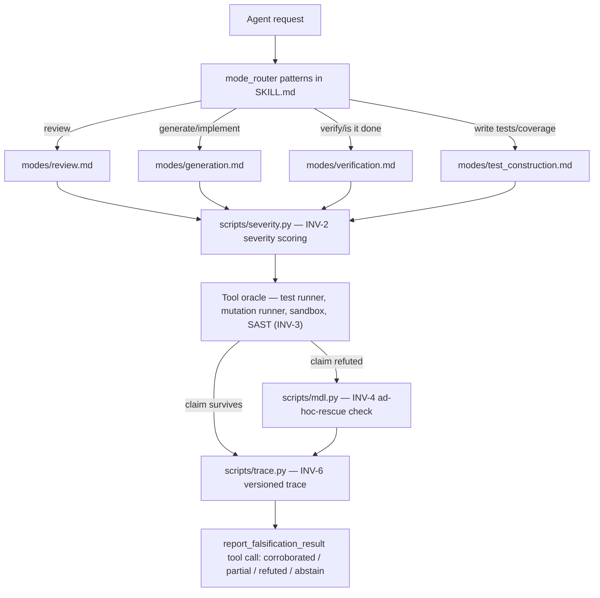

# Architecture

## System Boundary

This repository ships exactly one deliverable: a **Claude Agent Skill** named
`popperian-coding` (its registered identity, per `SKILL.md`'s `name:` field — deliberately
different from this repository's own name, `scaffold-skill`; see `PAPER.yml`'s
`frozen_strings` note). The skill is prose-and-YAML instructions for a coding agent, plus
three small stdlib-only Python helper scripts the skill's protocol calls as tools. It is
NOT a package, has no `pyproject.toml`, no installable Python distribution, and no test
suite — `Makefile`'s own `setup`/`test` targets are honest no-ops that state this rather
than fake a green result.

**Inside this repository:**
- `SKILL.md` — the skill's frontmatter (name, description, `allowed-tools`,
  `mode_router`) and the six invariants that bind every mode.
- `modes/` — the four mode protocols the router dispatches into.
- `scripts/` — three stdlib-only Python helpers (`severity.py`, `mdl.py`, `trace.py`)
  invoked by the modes via Bash, plus `check_paths.py`, a **collection-wide** move-safety
  gate (its own docstring: "Canonical move-safety gate for the manuscripts collection") —
  the one script here whose scope extends beyond this repository's own tree.
- `catalogs/` — YAML data consumed by the modes: `mutation_operators.yaml` (test-mutation
  operator definitions for `test_construction` mode STEP 5), `bug_classes/web_backend.yaml`,
  `domain_checklists/web_backend.yaml`.
- `PAPER.yml` — the collection's manuscript-tracking record: this repo's `role` is
  `studied-artifact`, `paper_of_record: false` — the skill is what a companion paper
  studies, not the paper itself.
- `ownerDocs/` — the owner scientific-memory workspace (context, status, decisions,
  literature, methods, progression, review rounds), same area-map contract used across the
  owner's repositories.
- `REPO-INFO/` — this technical layer.

**Crosses the boundary, does not live here:** the companion evaluation harness
`~/github/manuscripts/published/exec-refute` vendors a **byte-identical copy** of this
skill at `popperian_coding/skill/SKILL.md` and holds the compiled paper PDF
(`makale1.pdf`, no LaTeX source alongside it, per `PAPER.yml`). This repository is the
skill's canonical source; `exec-refute` is where it is evaluated and where the paper it
was studied in lives. `PAPER.yml` records `latex_home: null` — no LaTeX source for
arXiv:2606.06454 exists on disk anywhere in the collection as of the note's writing.

**Deliberately absent:** an installable package, a test suite (`pytest` collects 0 items
by design, per `Makefile`'s `test` target), an experiment/training harness (`repro` is a
documented no-op), and a falsification harness for the skill itself (`falsify` defers to
`../exec-refute`, since this repo is the object being studied, not the evaluator).

## Components and Responsibilities

| Component | Responsibility | Consumes | Produces |
|---|---|---|---|
| `SKILL.md` | Skill entry point: frontmatter, `mode_router` patterns, the six invariants (INV-1..INV-6), output-label discipline, mandatory `report_falsification_result` tool call | A coding-agent request | Dispatch into one of four modes, bound by the six invariants |
| `modes/generation.md` | Generation-mode protocol: spec-predicate extraction through a demarcation gate, six steps | A code-generation request | A `corroborated` / `partial` / `refuted` / `abstain` labelled output |
| `modes/review.md` | Review-mode protocol: classify, decompose into atomic conjectures, six steps | A diff or PR to review | A per-claim reviewed verdict |
| `modes/verification.md` | Verification-mode protocol: decompose "task complete" into V1..V6 sub-claims, re-execute the deliverable in a fresh sandbox | A completion claim from another agent | An independently re-executed verdict — never a self-grade |
| `modes/test_construction.md` | Test-construction protocol: spec→predicate extraction, test design against the mutation-operator catalogue | A request for test coverage | A severity-scored, mutation-checked test suite plan |
| `scripts/severity.py` | Estimates severity `[0,1]` for a candidate test against a candidate claim; corroboration-state update | Test/claim pairs from the planner step | A severity score and corroboration state, used by every mode |
| `scripts/mdl.py` | Computes structural-MDL of a candidate revision; decides ad-hoc-rescue (INV-4) | A refuted claim and its proposed revision | An `AdHocDecision` — permits or blocks the revision |
| `scripts/trace.py` | Appends conjecture/test/outcome/revision events to the versioned run trace (INV-6) | Mode-step events | The audit trace, read as auxiliary evidence by verification mode |
| `scripts/check_paths.py` | Collection-wide move-safety gate: checks tracked paths don't escape the repo and the git remote matches the expected card | The repository's own tracked file list and `.git` remote | Pass/fail path-safety verdict, run in CI |
| `catalogs/mutation_operators.yaml` | Defines mutation operators (`arith_op`, `comparison_op`, …) with bug-class targets, mutmut-derived | `test_construction` mode STEP 5 | The candidate mutation set for a suite-quality report |
| `catalogs/bug_classes/web_backend.yaml`, `catalogs/domain_checklists/web_backend.yaml` | Domain-specific bug-class and checklist data for the planner steps | Mode planner steps | Domain-scoped test/review targets |
| `PAPER.yml` | Collection manuscript-tracking record: bucket, arXiv id, role, companions, frozen strings | The owner's manuscript-collection convention | The authoritative disagreement-resolution source over `README.md` |
| `Makefile` | `setup` / `test` / `lint` / `type` / `smoke` / `falsify` / `paper` / `check-paths` / `repro` / `check` / `clean` verbs, several deliberate no-ops with stated reasons | Local dev invocation | `ruff`, `pyright`, `compileall` + CLI `--help` smoke, `check_paths.py` |
| `.github/workflows/ci.yml` | Runs lint, type check, `pytest` (tolerating exit 5 = no tests collected), and the path-safety gate on every push/PR | The committed tree | A CI pass/fail |
| `ownerDocs/` | Owner-controlled scientific memory (same eight-section README contract as sibling repos) | Owner input | Repository-specific research context |

## Runtime and Data Flow

There is no service runtime; the "run" is a Claude Code agent session invoking the skill.
The mode-selection and invariant-enforcement path, read directly from `SKILL.md`:

CI's independent flow (`.github/workflows/ci.yml`): checkout → `ruff check .` → `pyright
scripts` → `pytest -q` (tolerating exit 5) → `python scripts/check_paths.py`.

## State, Failure, and Recovery

There is no persistent runtime state in this repository — no database, no server process,
no artifact directory. The closest things to "state" are:

- **The versioned run trace** (`scripts/trace.py`'s `append_event` / `read_trace`) — an
  append-only audit log of conjectures, tests, outcomes, and revisions for one agent
  session, read back as auxiliary evidence by `verification` mode. Its storage location
  and format were not opened in this pass.
- **`ownerDocs/DECISIONS.md` and `ownerDocs/myProgression/`** — the owner-workspace
  append-only ledgers, shared convention across the owner's repositories.

**Failure handling is explicit and structural, not incidental:**
- A refuted claim may not be silently patched — `scripts/mdl.py` blocks a revision whose
  structural-MDL growth exceeds the refuting input's MDL (INV-4); the only sanctioned
  responses are a different revision or `abstain`.
- Ambiguity, a missing oracle, a doubted oracle, an exhausted budget, or the agent's own
  domain ignorance are all first-class `abstain(reason=..., blocking_question=...)`
  outcomes (INV-5) — never a best-effort guess.
- A text-only response instead of the mandatory `report_falsification_result` tool call is
  explicitly treated as a parse failure and logged as a calibration data-loss event
  (`SKILL.md`, "Structured reporting").
- `Makefile` targets that have nothing to run (`setup`, `test`, `falsify`, `paper`,
  `repro`) print why rather than fabricating a pass — a documented recovery-by-honesty
  convention for this specific repository shape.

## Architectural Invariants

Restated directly from `SKILL.md`, which is this repository's own authoritative statement
of them:

- **INV-1 Conjecture inventory is explicit** — no monolithic "looks right" judgment; every
  output decomposes into named atomic claims.
- **INV-2 Severity is mandatory** — every test carries a `[0,1]` severity estimate; below
  the configured floor (default 0.20) a test does not count toward corroboration.
- **INV-3 Oracle independence** — never self-grade; the oracle must be a tool, or, second
  tier, a different model instance than the one that produced the answer.
- **INV-4 No ad hoc rescue** — a revision after refutation is permitted only when
  `scripts/mdl.py` finds its structural-MDL growth smaller than the refuting input's MDL.
- **INV-5 Abstain is first-class** — silent best-effort delivery is explicitly the *worse*
  outcome under this skill.
- **INV-6 Trace is versioned** — every conjecture/test/outcome/revision is appended via
  `scripts/trace.py`.
- **Output-label discipline** — the only legal labels are `corroborated(κ=…)`, `partial`,
  `refuted`, `abstain`; `verified`, `proven`, `complete`, `done`, `LGTM` are explicitly
  banned as labels.
- **The skill's registered identity (`popperian-coding`) is frozen** independent of this
  repository's own name (`scaffold-skill`), because a byte-identical copy is vendored into
  `exec-refute` — renaming either would desynchronize the studied artifact from what this
  repository publishes.

## Validation Architecture

| Layer | Purpose | Location |
|---|---|---|
| Lint | Style/correctness lint over the whole repo | `ruff check .` (`Makefile` `lint`, CI) |
| Type check | Static typing over the helper scripts | `pyright scripts` (`Makefile` `type`, CI) |
| Byte-compile + CLI smoke | Confirms `scripts/` compiles and each CLI responds to `--help` | `Makefile` `smoke` (not wired into CI) |
| Unit / integration tests | absent by design — `pytest` collects 0 items; CI tolerates exit code 5 rather than treating it as failure | none (`tests/` does not exist) |
| Path-safety gate | Confirms tracked paths do not escape the repo and the git remote matches expectation | `scripts/check_paths.py` (`Makefile` `check-paths`, CI) |
| Skill falsification (of THIS skill, as a research subject) | absent here by design — delegated to the companion evaluation repository | `~/github/manuscripts/published/exec-refute` |

## Truth level

Measured directly by opening: `README.md`, `SKILL.md` in full, `PAPER.yml` in full,
`REPO-INFO/README.md`, `REPO-INFO/CODE-MAP.md` (30 files: 26 Markdown, 4 Python — note this
generated map's own extension set does not enumerate the YAML catalogs or `PAPER.yml`/
`CITATION.cff`/`LICENSE`, which were confirmed present by direct `find`/`cat` instead),
`Makefile` in full, `.github/workflows/ci.yml` in full, the heading structure of all four
`modes/*.md` files, and the head of `catalogs/mutation_operators.yaml`. Not opened in this
pass: the full body of `modes/generation.md`, `modes/review.md`, `modes/verification.md`,
`modes/test_construction.md` beyond their headings; `scripts/severity.py`,
`scripts/mdl.py`, `scripts/trace.py`, `scripts/check_paths.py` source (their responsibilities
above are drawn from `SKILL.md`'s own description and `REPO-INFO/CODE-MAP.md`'s generated
symbol/summary table, not independently re-derived by reading the implementation);
`catalogs/bug_classes/web_backend.yaml`, `catalogs/domain_checklists/web_backend.yaml`
bodies beyond line counts; and the `ownerDocs/` subarea contents. The trace format and
storage location (`scripts/trace.py` internals) are explicitly NOT MEASURED.
